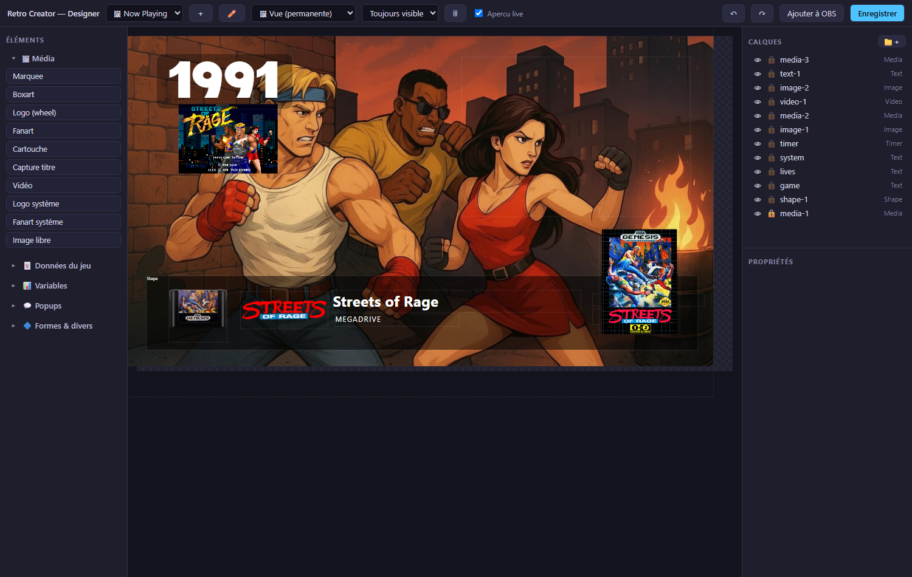

# Guide du Designer

Le Designer suit une **logique de calques** (pensez Photoshop) : un canvas au
centre, la palette d'éléments à gauche, calques et propriétés à droite.

## Documents : vues, popups, composants

Chaque document a un **type**, choisi dans l'entête :

- 🖼 **Vue (permanente)** — un overlay qui vit dans votre logiciel de stream.
  Elle peut être *toujours visible*, ou seulement *dans le menu* / *en jeu*.
- 💬 **Popup (temporaire)** — invisible par défaut ; un Flow l'affiche
  quelques secondes (action *afficher une popup* → choisissez votre popup).
- 🧩 **Composant** — une brique réutilisable.

Créez, renommez ou supprimez les documents depuis l'entête ou le menu natif
**Designer**. La suppression vous avertit si le document est utilisé par vos
flows.

## La palette d'éléments

Groupée par usage, chaque entrée est un **preset** — elle arrive pré-réglée :

- **Média** — marquee, boxart, logo (wheel), fanart, cartouche, capture
  titre, vidéo, **logo système**, **fanart système**, image libre.
- **Données du jeu** — titre, nom/code du système, année, genre, développeur,
  éditeur, note ★, description, constructeur, année du système, texte composé
  (`Sorti en {game.year} par {game.publisher}`), texte libre.
- **Variables** — score, timer, vies, compteur pièces/anneaux, dernier viewer
  Twitch, barre de progression.
- **Popups** — la popup de succès, plus vos propres popups.
- **Formes** — rectangle (avec fond), input viewer.

Vos propres fichiers (dossier configuré dans Paramètres → *Mes médias*)
apparaissent dans le sélecteur de source Média en entrées `user:`.

## Les calques

- **Glisser-déposer** pour réordonner — la profondeur est gérée
  automatiquement, deux calques ne partagent jamais le même plan.
- 👁 masque un calque, 🔒 le verrouille (sélectionnable, plus déplaçable).
  Les deux marchent aussi sur des **dossiers** entiers (📁+ pour en créer).
- Les calques se **nomment** (propriété *nom du calque*).

## Les propriétés

Trois groupes repliables — l'état ouvert/fermé est partagé entre calques :

- **Calque** — position, taille, z, opacité, dossier, **fond** (couleur +
  opacité en %, coins arrondis, padding — les nouveaux calques texte arrivent
  avec un discret fond noir 30 %), et la **transition de mise à jour**
  (aucune / fondu / glissement horizontal / vertical / pop) jouée à chaque
  changement de contenu.
- **Contenu** — la donnée liée (avec suggestions), le texte composé, le format
  (`rating:stars` transforme 0.8 en ★★★★☆), le repli.
- **Style** — police (polices système **ou vos fichiers** déposés dans le
  dossier `fonts` à côté de l'application), taille, gras, couleur, alignement,
  **ombre portée** (opt-in ; soit l'*ombre globale* de la vue partagée par
  tous les calques, soit une ombre propre) et **contour** (extérieur /
  intérieur / centré, épaisseur, couleur).

## Aperçu live & OBS

L'**aperçu live** est actif par défaut — le canvas rend les vraies données et
les vrais visuels du jeu courant, et se rafraîchit quand vous changez de jeu
dans le menu.

**Ajouter à OBS** enregistre la vue puis crée/met à jour une source navigateur
nommée `RC - <nom de la vue>` dans la scène OBS courante. L'URL porte un
tampon de version à chaque envoi : le logiciel de stream ne ressert jamais une
page en cache.
