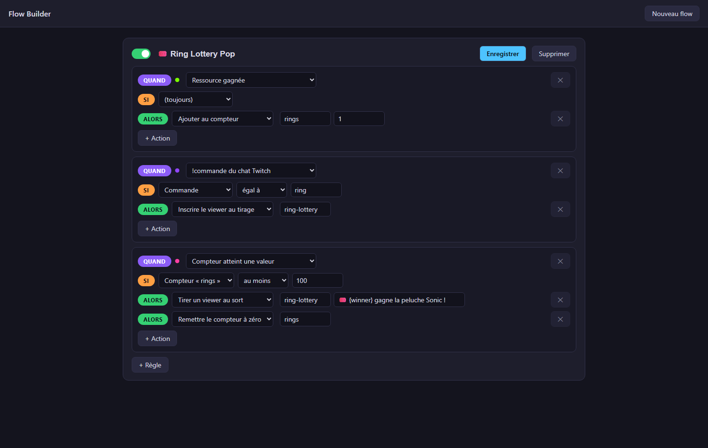

# Flows & Event dashboard

Two tabs, one process: **Flows** is where you *condition* a mechanic,
**Event** is where you *activate and watch* it.

## Flows — condition the process

A flow is a set of readable rules:

> **When** `ring gained` → **Then** `add 1 to counter rings`
>
> **When** `counter reached` **If** `counter rings at least 100` →
> **Then** `show popup 🎉`, `reset counter rings`

- **When** — any event from the catalogue: game events (life lost, game over,
  rings/coins, high score, level…), Twitch chat messages and !commands,
  counters, API state.
- **If** — a closed condition on a payload field or a counter. Values can be
  **numbers** (`at least 100`) or **text** (`command equals ring`).
- **Then** — actions: show a popup (simple, or one of *your* designed popups),
  add/reset counters, switch OBS scene, show/hide a source, play a media
  (the selectors list **your real OBS scenes and sources**), call a webhook,
  announce on Discord, enter a viewer into a draw, pick a random viewer.

The 20 catalogue widgets (Widgets tab) each ship a **ready-made flow**: the
*Edit* button creates it on first click, then always brings you back to it.

## Event — the dashboard

**Automated games** — pick one of your flows:

- **▶ Activate / ⏸ Deactivate** it (a disabled flow does nothing);
- **Edit in Flows** jumps back to the builder;
- live tiles show the flow's **counters**, the **draw participants** joining
  in real time, the **last winner** and the **last popup**.

**Quick contest** — a one-off draw without any flow: type the !command, the
duration, press start. Countdown, live participant chips, counter, random
winner announced on screen and on the overlay.
