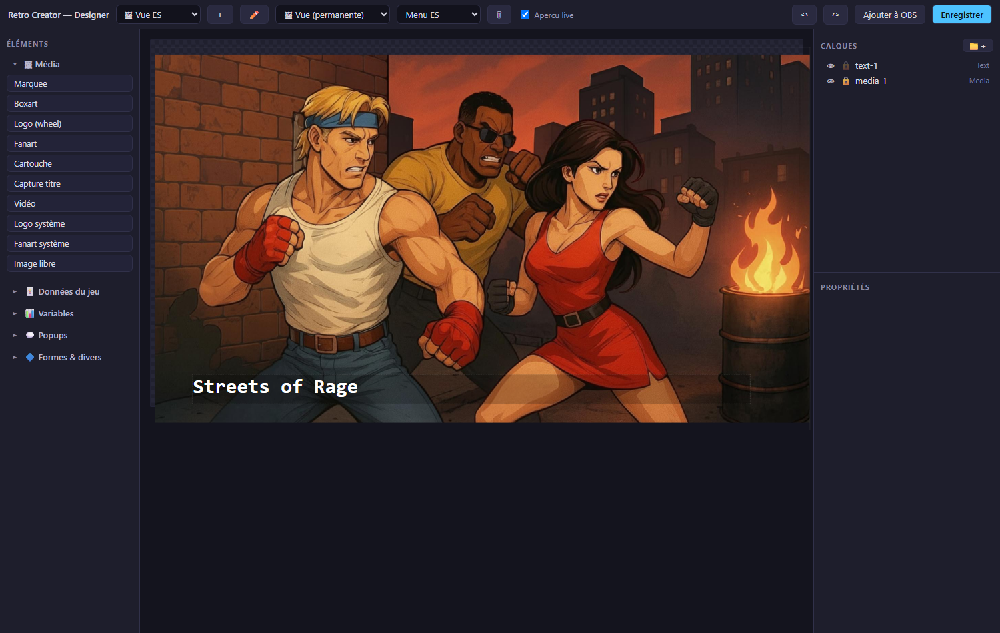

# Getting started

Retro Creator runs next to [RetroBat](https://www.retrobat.org/) and turns real
gameplay data into stream overlays and automations. Here is the full path from
zero to a live overlay.

## 0. Install

1. [Download the latest release](https://github.com/Nelfe80/RetroCreator-Wiki/releases/latest) (`RetroCreator-x.y.z.7z`).
2. Extract the archive into your **`RetroBat\plugins\`** folder — you end up
   with `RetroBat\plugins\RetroCreator\RetroCreator.exe`.
3. Launch `RetroCreator.exe`.

!!! info "Windows SmartScreen"
    The executable is signed `CN=nelfeTech` (self-signed). On first launch
    Windows may show a SmartScreen warning: click **More info → Run anyway**.
    You can verify the download with the SHA-256 published on the release page.

## 1. Launch and connect

1. Start **RetroBat** (EmulationStation), with the APIExpose plugin enabled.
2. Launch **Retro Creator**. The app opens on the **Listener** view with a single
   button: **Connect**.
3. Click **Connect** — the status bar at the bottom turns green
   (`Connected`). From now on every game you browse or play feeds the app.

!!! tip "No RetroBat around?"
    Click **Try demo mode** under the Connect button: a simulated game session
    runs through the whole pipeline so you can explore every view.

??? note "Under the hood — what Connect actually does"
    Retro Creator talks to the local APIExpose service (`127.0.0.1:12345`) shipped
    with RetroBat: current game and artwork, plus the live gameplay events of the
    running game. Nothing leaves your machine at this stage — the connection is
    local, read-only, and reconnects by itself if you restart RetroBat.

The interface is organised around the **Mode** menu:

| Mode | What it is for |
|---|---|
| **Listener** | The pulse of your stream — every game event orbits the current game logo, live. |
| **Designer** | Compose your overlay views, popups and components. |
| **Flows** | Condition your automations: *When… If… Then…* — triggers can target one exact moment (`Life lost`) or a whole family (`any score/collectible moment`). |
| **Event** | The dashboard: activate your automated games, run chat contests and Live Contests. |
| **Widgets** | The catalogue of 20 ready-made stream mechanics — with a per-game compatibility badge and a 🧪 Test button that replays the moment without playing it. |
| **Templates** | Ready-made event views: one click creates the view in your workspace and opens it in the Designer. |

The **Editions** menu shows your license tier (Lite, Pro, Studio), and
**File → Settings** holds your connections (OBS, Twitch, NelfeTech…).

The **Monitor** button in the status bar opens a terminal with the raw event
log (6 lines) — handy to check what the games actually emit.

## 2. Build a view in the Designer

1. Open **Mode → Designer**.
2. Pick elements from the left palette — they are grouped by usage
   (**Media**, **Game data**, **Variables**, **Popups**, **Shapes**) and arrive
   pre-configured: *Game title*, *Year*, *Rating ★*, *Marquee*, *Boxart*,
   *System logo*…
3. Everything follows a layers logic: reorder by **drag & drop**, group into
   folders, hide (👁) or lock (🔒) layers, rename them.
4. Properties are grouped in three collapsible sections: **Layer** (position,
   size, fill, update transition), **Content** (data binding, composed text),
   **Style** (font — system or your own files —, size, colour, alignment,
   drop shadow, stroke).
5. **Live preview** is on by default: the canvas shows the real data and
   artwork of the current game.

## 3. Send it to your streaming software

Click **Add to OBS** in the Designer header: the view is saved and pushed as a
browser source named `RC - <view name>` into the current scene
(requires the obs-websocket password, see [Settings](#5-settings)).
After the first push the button becomes **Update in OBS**.

Any web-capable streaming software works: the view is a plain local URL
(`http://127.0.0.1:19780/overlay/<view>`), so you can paste it manually into
Streamlabs, Meld Studio, etc.

## 4. Automate with Flows

Open **Mode → Flows** and describe reactions in plain sentences:

> **When** *life lost* → **Then** *show a popup* « 💥 {game} strikes again! »

Conditions accept numbers (*counter at least 100*) and text
(*chat command equals `ring`*). Actions include popups (simple or a popup you
designed), counters, OBS scene/source/media control, webhooks, Discord —
scene and source selectors list **your actual OBS content**.

## 5. Settings

**File → Settings…** opens a dialog for:

- **Twitch** — your channel name. That is *all* it takes to read your chat
  (anonymous, read-only, no key): see [Twitch integration](twitch.md).
- **OBS Studio** — the obs-websocket password (Tools → WebSocket Server
  Settings in OBS). Stored encrypted, never displayed.
- **My media** — a folder of your own images/videos, exposed to the Designer
  as `user:` sources.
- **Discord** — a default webhook for announcements.

A **light/dark theme** toggle lives in **File → Light/dark theme**.

## 6. Save your work

**File → Save** writes your whole configuration (views + flows) into a single
`.rct` project file; **File → Open…** restores it — handy for backups or for
sharing a complete stream setup between machines.
