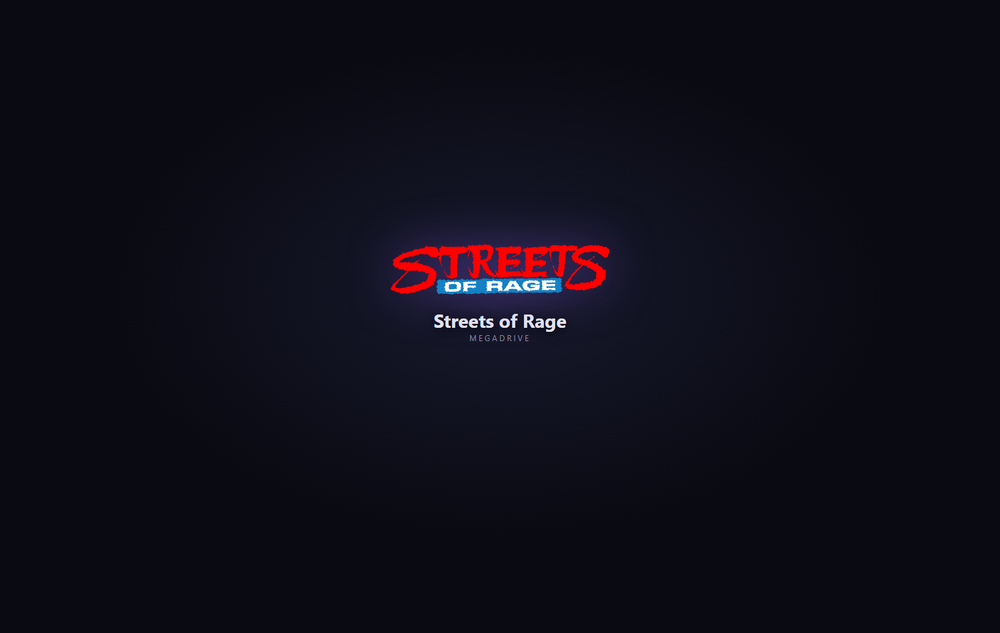

# Retro Creator

**Live overlay studio for retro-gaming streams — powered by real gameplay data.**

Retro Creator turns what actually happens in your retro games — current game, live
score, timers, lives, RetroAchievements, inputs — into polished stream overlays and
live automations, without writing a single line of code.

It is built on top of [RetroBat APIExpose](https://github.com/Nelfe80/RetroBat-APIExpose)
and its open [Data/Event SDK](https://github.com/Nelfe80/APIExpose-SDK).

## What it does

- **Visual designer** — compose overlays with ready-made widgets (score, timer, now
  playing, boxart, achievement popups, input viewer…), themes and animations.
- **Works with your streaming setup** — overlays are served locally as standard
  browser sources, compatible with OBS Studio, Streamlabs Desktop, Meld Studio and
  any software that renders web pages.
- **Live automations** — gameplay events can trigger your existing tools:
  Streamer.bot, Stream Deck, Touch Portal, webhooks, Discord, MQTT / Home Assistant
  and more.
- **Local first** — no account, no cloud required. Your data stays on your machine.
- **English & French** interface, more languages to come.

## Documentation

- **[Getting started](getting-started.md)** — from zero to a live overlay.
- **[Designer guide](designer.md)** — views, popups, components, layers, styles.
- **[Flows & Event](flows-events.md)** — automations and the live dashboard.
- **[Twitch integration](twitch.md)** — plug your chat (no key needed) and run contests.

## Status

Retro Creator is **in active development** — not released yet. This site hosts the
official documentation and the [issue tracker](support.md).

!!! tip "Stay in the loop"
    Watch the [GitHub repository](https://github.com/Nelfe80/RetroCreator-Wiki) to be
    notified when the first public version ships.
