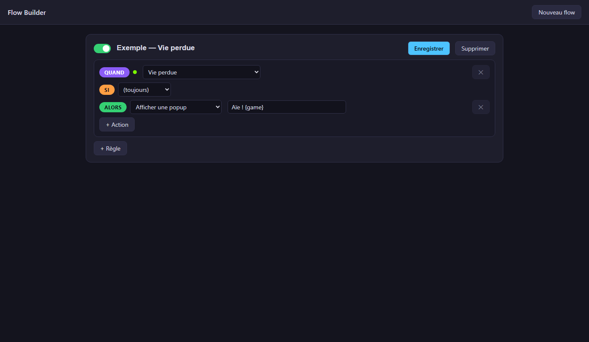
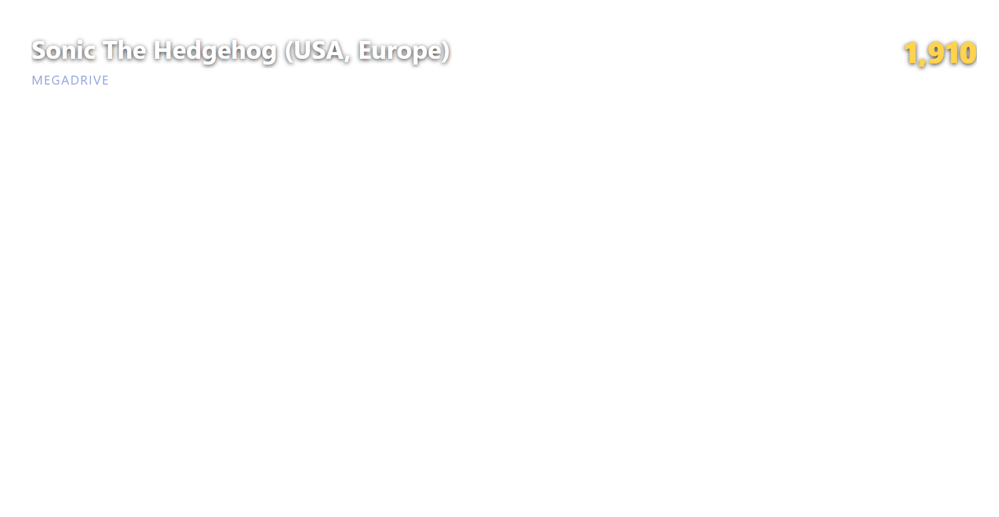
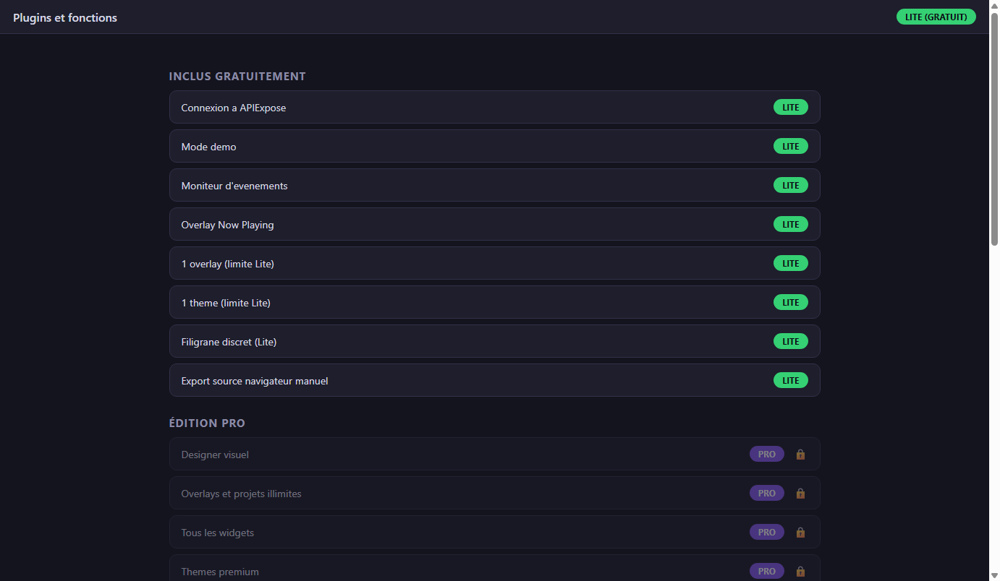

# Development progress

Real screenshots from the current development build — updated as features land.

## Flow Builder — no-code live scenarios

Build interactive scenarios by connecting readable blocks: **When** a game event
happens, **If** a condition is met, **Then** run actions (popups, counters,
webhooks, Discord announcements…). Events come straight from the running game
(lives, score, timers, achievements, in-game memory events) and are displayed in
your language.

## Live overlay

The overlay is served locally as a transparent browser source and updates the
instant the game does — here with a real score read from a running game.

## Visual designer

Compose your overlay with widgets, layers and properties — the preview is the
exact same renderer as the final browser source.

## Features by edition

Every feature and connector is listed in the app, with its edition badge —
locked items simply unlock with your license.

---

*Retro Creator is in active development. Watch the
[GitHub repository](https://github.com/Nelfe80/RetroCreator-Wiki) to be notified
of releases, and report anything odd in the
[issue tracker](https://github.com/Nelfe80/RetroCreator-Wiki/issues).*
