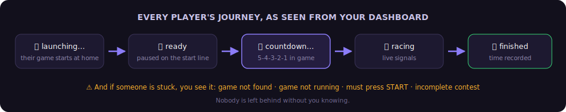

# Intégration Twitch

Retro Creator lit votre chat Twitch **sans clé, sans token, sans mot de
passe** : il rejoint votre chaîne anonymement, en lecture seule. Il ne peut
rien écrire — zéro risque pour votre chaîne.

## 1. Brancher sa chaîne

1. Ouvrez **Fichier → Paramètres…**
2. Dans la carte **Twitch**, tapez le nom de votre chaîne (ex. `ma_chaine`)
   et enregistrez.
3. L'entête de l'onglet Event confirme l'état :
   `🟣 chat Twitch connecté · #ma_chaine`.

Dès lors, chaque message du chat devient un événement du pipeline :

| Événement | Quand |
|---|---|
| **Message du chat Twitch** | un viewer écrit n'importe quoi |
| **!commande du chat Twitch** | un viewer tape une `!commande` (ex. `!ring 3`) |

Ils apparaissent dans la vue Live, dans le Moniteur, et déclenchent des
**Flows** comme n'importe quel événement de jeu. Le Designer gagne aussi des
données liées : *dernier viewer*, *dernier message*.

## 2. Lancer un concours de chat (zéro configuration)

Ouvrez **Mode → Event** → **Concours express** :

1. Choisissez la **!commande** que les viewers doivent taper (le *slug*,
   ex. `!go`), la **durée**, et le message du gagnant.
2. Appuyez sur **▶ Démarrer la participation** — le décompte tourne, la liste
   des participants grossit en direct (une entrée par viewer, même s'il
   spamme), avec un compteur.
3. À zéro, un gagnant est tiré au sort : grande annonce à l'écran **et** popup
   sur votre overlay OBS.

## 3. Automatiser les concours avec les Flows (ex. Ring Lottery)

Pour les mécaniques récurrentes, tout se conditionne dans **Flows** et se
pilote depuis **Event** :

1. **Widgets → Ring Lottery Pop → Éditer** crée le scénario prêt à l'emploi :
      - chaque anneau ramassé en jeu incrémente un compteur ;
      - chaque viewer qui tape `!ring` entre dans le pool du tirage ;
      - à 100 anneaux, un gagnant est tiré et annoncé.
2. Changez le *slug* en éditant la condition **Si** de la règle
   (`commande du chat = ring` → mettez ce que vous voulez).
3. Dans **Event → Jeux automatisés**, sélectionnez le flow, appuyez sur
   **▶ Activer**, et suivez le tableau de bord : compteur d'anneaux,
   participants qui s'inscrivent en direct, dernier gagnant.

!!! note "Et écrire dans le chat ?"
    Annoncer les gagnants *dans le chat* (et pas seulement sur l'overlay)
    demande une autorisation Twitch (OAuth). C'est sur la feuille de route ;
    aujourd'hui toutes les annonces se font à l'écran — là où les viewers
    regardent, de toute façon.

## 4. Live Contest : vos viewers jouent chez eux

Le **Live Contest** va plus loin que le chat : vos viewers lancent le **même
jeu chez eux** (RetroBat + APIExpose) et leurs vraies données de jeu remontent
en direct — premier à 10 anneaux, meilleur score, contre-la-montre…
Tout est orchestré automatiquement : lancement du jeu, départ simultané,
scores, résultats.

??? note "Sous le capot — des objectifs équitables"
    Un objectif de contest est lié à un vrai signal de gameplay du jeu sélectionné
    (les mêmes événements normalisés qui pilotent vos overlays). À la création du
    contest, l'empreinte exacte de la définition d'événements du jeu voyage avec
    lui : tous les participants sont mesurés sur les mêmes signaux, sur la même
    version du jeu — et le sélecteur ne propose que des moments qui peuvent
    réellement se déclencher.

### Une fois pour toutes : le jeton streamer

1. **Fichier → Paramètres → NelfeTech** → *Obtenir mon jeton (connexion
   Twitch)* : connectez-vous avec votre compte Twitch.
2. Cliquez **📥 Envoyer vers Retro Creator** : le jeton s'enregistre tout
   seul (un ✅ le confirme des deux côtés, bouton 🗑 pour le supprimer).

### Créer et lancer un contest

Dans **Mode → Event**, cliquez **＋ Nouvel événement** et choisissez le type —
🏆 **Live Contest** (vos viewers jouent chez eux), 🤖 **Jeu automatisé** (un
scénario Flows qui vit pendant votre partie) ou 🎟️ **Concours express** (un
tirage ponctuel dans le chat). Choisissez **Live Contest**, avec un jeu
sélectionné dans RetroBat :

1. **Titre**, **!commande**, **Mode** (course, meilleur score,
   contre-la-montre, survie), **Signal du jeu** — lu directement dans le
   fichier .MEM du jeu courant — et **Cible**.
2. **Participation** : tous les viewers, **abonnés uniquement**, ou via une
   **récompense en points de chaîne**.
3. **Message du bot** : le texte que le bot postera dans le chat avant le
   lien (ex. *🎮 Clique ici pour jouer ➜*), et **Consigne affichée aux
   joueurs** : votre phrase d'objectif, affichée en grand chez chaque joueur
   (ex. *Collecte 20 anneaux le plus vite possible !*).
4. **🧪 Manche de test** (optionnel) : les scores d'essai sont effacés à
   l'ouverture réelle, les inscrits restent.
5. **▶ Ouvrir les inscriptions** : chaque viewer qui tape la !commande
   reçoit du bot un **lien court personnel** dans le chat. Il confirme avec
   Twitch — et c'est tout : **son jeu se lance chez lui automatiquement**.

### Ce que vit le viewer (tout est automatique)

1. Il confirme → son APIExpose prend le relais : le jeu se lance, une
   fenêtre en surimpression lui dit **« Appuie sur START ! »**.
2. Dès que sa partie commence, elle est **mise en pause** — il est *prêt*.
   Votre tableau de bord affiche **« prêts : x / y »** en direct, et signale
   ceux qui coincent (*⚠ jeu introuvable*, *⚠ doit appuyer sur START*…).

    

3. **🏁 Départ** : décompte **5-4-3-2-1 en grand dans le jeu**, puis GO —
   toutes les pauses sautent **à la même milliseconde**.
4. En course, le premier arrivé à la cible voit son jeu se mettre en pause :
   son **temps** est enregistré, « 🏁 Objectif atteint ! », et RetroArch se
   ferme tout seul — pas besoin d'attendre votre clôture.
5. **⏹ Clôturer** : classement figé (les **temps** en mode course), export
   **CSV**, **flux résultats JSON** stable pour vos overlays, **↻ Relancer**.

!!! tip "Côté viewer : une seule chose à faire"
    Installer RetroBat + le plugin APIExpose et activer l'option
    **GAME EVENTS MANAGER → ACTIVER LES LIVE CONTESTS** dans les menus
    RetroBat. Le guide pas-à-pas à partager :
    la page *Guide* de la plateforme (lien sur chaque page d'inscription).

!!! tip "Recommandé : passez le bot modérateur"
    Tapez une fois `/mod RetroCreatorBot` dans votre chat : beaucoup de
    chaînes bloquent les liens des non-modérateurs. Le bot ne rejoint votre
    chat que pendant les inscriptions, et le quitte ensuite.
