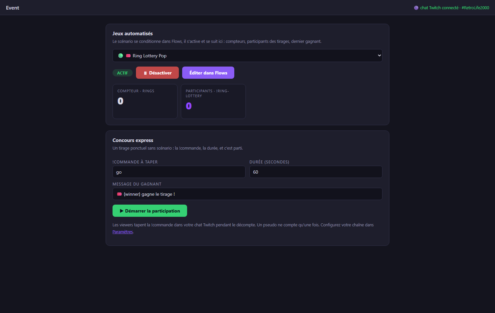

# Twitch integration

Retro Creator reads your Twitch chat **without any key, token or password**:
it joins your channel anonymously, in read-only mode. It cannot write anything,
so there is zero risk for your channel.

## 1. Plug your channel

1. Open **File → Settings…**
2. In the **Twitch** card, type your channel name (e.g. `my_channel`) and save.
3. The Event tab header confirms the state: `🟣 Twitch chat connected · #my_channel`.

From that moment, every chat message becomes an event in the pipeline:

| Event | When |
|---|---|
| **Twitch chat message** | a viewer writes anything |
| **Twitch chat !command** | a viewer types a `!command` (e.g. `!ring 3`) |

They appear in the Live view, in the Monitor, and can trigger **Flows** like
any game event. The Designer also gets bindings: *last viewer*, *last message*.

## 2. Run a chat contest (no configuration)

Open **Mode → Event** → **Quick contest**:

1. Choose the **!command** viewers must type (the *slug*, e.g. `!go`),
   the **duration**, and the winner message.
2. Press **▶ Start participation** — the countdown runs, the participant list
   grows in real time (one entry per viewer, even if they spam), with a live
   counter.
3. At zero, a winner is drawn: big announcement on screen **and** a popup on
   your OBS overlay.

## 3. Automate contests with Flows (e.g. Ring Lottery)

For recurring mechanics, condition everything in **Flows** and pilot it from
**Event**:

1. **Widgets → Ring Lottery Pop → Edit** creates the ready-made flow:
      - every ring collected in-game increments a counter;
      - every viewer typing `!ring` joins the draw pool;
      - at 100 rings, a winner is drawn and announced.
2. Change the *slug* by editing the rule's **If** condition
   (`chat command equals ring` → put whatever you want).
3. In **Event → Automated games**, select the flow, press **▶ Activate**, and
   watch the dashboard: ring counter, participants joining live, last winner.

!!! note "What about writing to the chat?"
    Announcing winners *in the chat* (not just on the overlay) requires a
    Twitch authorization (OAuth). This is on the roadmap; today all
    announcements happen on-screen, which is what viewers watch anyway.

## 4. Live Contest: your viewers play at home

The **Live Contest** goes beyond chat: your viewers launch the **same game at
home** (RetroBat + APIExpose) and their real game data streams back live —
first to 10 rings, best score, time attack…

### One-time setup: the streamer token

1. **File → Settings → NelfeTech** → *Get my token (Twitch login)*: log in
   with your Twitch account.
2. Click **📥 Send to Retro Creator**: the token registers itself in the app
   (a ✅ confirms it on both sides). A 🗑 button in Settings deletes it.

### Create and run a contest

In **Mode → Event → Live Contest**, with a game selected in RetroBat:

1. **Title**, **!command** (what viewers will type), **Mode** (race, best
   score, time attack, survival), **Game signal** — the list is read straight
   from the current game's .MEM file — and **Target**.
2. **Who can join**: all viewers, **subscribers only**, or through a
   **channel-point reward** (the viewer must type the !command via the
   points redemption; create a "with text" reward on your Twitch dashboard).
3. **🧪 Test round** (recommended): a few viewers enrol and play so you can
   check the signals flow. When you open for real, their test scores are
   wiped — but they stay enrolled.
4. **▶ Open registrations**: every viewer typing the !command gets a personal
   link (shown on the card, paste it in chat). They log in with Twitch,
   confirm, and open their **game client** — a simple web page that reads
   their game through their local APIExpose and pushes progress every
   3 seconds.
5. **🏁 Start**, watch the live leaderboard, **⏹ Close**: the standings are
   frozen, the **CSV** export becomes available, and **↻ Run again**
   instantly recreates an identical contest.

!!! tip "On the viewer side"
    Viewers install nothing beyond RetroBat + APIExpose: the enrolment link
    leads to a confirmation page, then to the game client in their browser.
    If "Local APIExpose" shows red, they must launch RetroBat with the
    APIExpose plugin and start the game.
