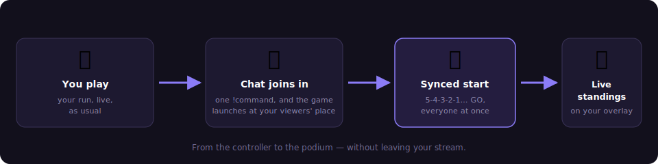

# Twitch integration

Retro Creator reads your Twitch chat **without any key, token or password**:
it joins your channel anonymously, in read-only mode. It cannot write anything,
so there is zero risk for your channel.

## 1. Plug your channel

1. Open **File → Settings…**
2. In the **Twitch** card, type your channel name (e.g. `my_channel`) and save.
3. The Event tab header confirms the state: `🟣 Twitch chat connected · #my_channel`.

From that moment, every chat message becomes an event in the pipeline:

| Event | When |
|---|---|
| **Twitch chat message** | a viewer writes anything |
| **Twitch chat !command** | a viewer types a `!command` (e.g. `!ring 3`) |

They appear in the Live view, in the Monitor, and can trigger **Flows** like
any game event. The Designer also gets bindings: *last viewer*, *last message*.

## 2. Run a chat contest (no configuration)

Open **Mode → Event** → **Quick contest**:

1. Choose the **!command** viewers must type (the *slug*, e.g. `!go`),
   the **duration**, and the winner message.
2. Press **▶ Start participation** — the countdown runs, the participant list
   grows in real time (one entry per viewer, even if they spam), with a live
   counter.
3. At zero, a winner is drawn: big announcement on screen **and** a popup on
   your OBS overlay.

## 3. Automate contests with Flows (e.g. Ring Lottery)

For recurring mechanics, condition everything in **Flows** and pilot it from
**Event**:

1. **Widgets → Ring Lottery Pop → Edit** creates the ready-made flow:
      - every ring collected in-game increments a counter;
      - every viewer typing `!ring` joins the draw pool;
      - at 100 rings, a winner is drawn and announced.
2. Change the *slug* by editing the rule's **If** condition
   (`chat command equals ring` → put whatever you want).
3. In **Event → Automated games**, select the flow, press **▶ Activate**, and
   watch the dashboard: ring counter, participants joining live, last winner.

!!! note "What about writing to the chat?"
    Announcing winners *in the chat* (not just on the overlay) requires a
    Twitch authorization (OAuth). This is on the roadmap; today all
    announcements happen on-screen, which is what viewers watch anyway.

## 4. Live Contest: your viewers play at home

The **Live Contest** goes beyond chat: your viewers launch the **same game
at home** (RetroBat + APIExpose) and their real game data streams back live —
first to 10 rings, best score, time attack… Everything is orchestrated
automatically: game launch, simultaneous start, scores, results.

??? note "Under the hood — how objectives stay fair"
    A contest objective is bound to a real gameplay signal of the selected game
    (the same normalized events that power your overlays). When the contest is
    created, the game's exact event definition fingerprint travels with it, so every
    participant is measured on the same signals, on the same game version — and the
    signal picker only offers moments that can actually fire.

### One-time setup: the streamer token

1. **File → Settings → NelfeTech** → *Get my token (Twitch login)*: log in
   with your Twitch account.
2. Click **📥 Send to Retro Creator**: the token registers itself (a ✅
   confirms it on both sides, 🗑 button to delete it).

### Create and run a contest

In **Mode → Event → Live Contest**, with a game selected in RetroBat:

1. **Title**, **!command**, **Mode** (race, best score, time attack,
   survival), **Game signal** — read straight from the current game's .MEM
   file — and **Target**.
2. **Who can join**: all viewers, **subscribers only**, or through a
   **channel-point reward**.
3. **Bot message**: the text the bot posts in chat before the link
   (e.g. *🎮 Click here to play ➜*), and **Player brief**: your objective
   sentence, shown big on every player's screen (e.g. *Collect 20 rings as
   fast as you can!*).
4. **🧪 Test round** (optional): trial scores are wiped when you open for
   real, participants stay enrolled.
5. **▶ Open registrations**: every viewer typing the !command gets a
   **short personal link** from the bot in chat. They confirm with Twitch —
   and that's it: **their game launches at home automatically**.

### What the viewer experiences (all automatic)

1. They confirm → their APIExpose takes over: the game launches, an on-top
   window says **"Press START!"**.
2. As soon as their run begins it is **paused** — they are *ready*. Your
   dashboard shows **"ready: x / y"** live and flags whoever is stuck
   (*⚠ game not found*, *⚠ must press START*…).
3. **🏁 Start**: a big in-game **5-4-3-2-1 countdown**, then GO — every
   pause lifts **at the same millisecond**.
4. In race mode, the first player to reach the target sees their game pause:
   their **time** is recorded, "🏁 Target reached!", and RetroArch closes by
   itself — no need to wait for you to close the contest.
5. **⏹ Close**: standings frozen (race shows **times**), **CSV** export, a
   stable **JSON results feed** for your overlays, **↻ Run again**.

!!! tip "Viewer side: a single thing to do"
    Install RetroBat + the APIExpose plugin and enable
    **GAME EVENTS MANAGER → ENABLE LIVE CONTEST** in the RetroBat menus.
    The step-by-step guide to share: the platform's *Guide* page (linked
    from every enrolment page).

!!! tip "Recommended: make the bot a moderator"
    Type `/mod RetroCreatorBot` once in your chat: many channels block
    links from non-moderators. The bot only joins your chat during
    registrations, and leaves afterwards.
